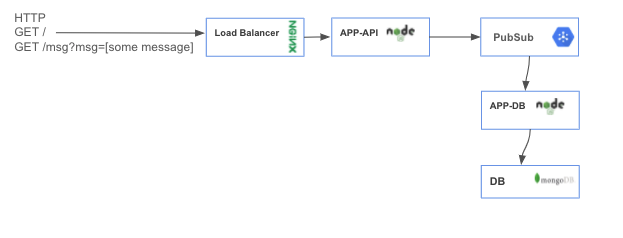

# gcp-ansible-demo

## Tech stack
- GCP (compute engine, service accounts, pubsub, networking) to host our infra
- terraform - to provision our infra
- ansible - to manage configuration and deployment
- nodeJS - both apps used in this exercise are written on nodeJS
- nginx - to serve and loadbalance http traffic


## The App (Data Pipeline)


This is a high level diagram of an application we're going to build, roll out and improve. It's contain several components:
- Web OR LoadBalancer (nginx) to serve and proxy http traffic
- APP-API (nodejs) application that will recieve messages from outside and push them into the queue (pubsub)
- PubSub - message queue
- APP-DB (nodejs) application that will consume messages from the queue and save them into DB
- DB (mongoDB) our main database to store messages

Let's rollout a simple service with infrastructure and improve it!

## Create our stack

### Step 0: Create docker image with tooling
Go to [this folder](./utilities/docker-image-bins/) and create the docker image we will use as a base for everything.

### Step 1: Init terraform
Go to [this folder](./terraform/init-project/) and initialize the bucket and the service account we will use for Terraform.

### Step 2: Deploy infra
Now [go to the main Terraform folder](./terraform/) and create the infrastructure for our project.

### Step 2: Configure application and software.
Now [go to the Ansible folder](./ansible/) and configure our application with the chosen configuration.

Result of the action should be applied configuration for services:
- Load Balancer (nginx)
- APP-API (nodejs)
- DB (mongoDB)

## Test all is working
Check the web and api stack works with:
```bash
curl -v http://<WEB_IP>/ -> *"Up and running!!"*
curl -v http://<WEB_IP>/msg?msg=testing -> *"Message sent to pubsub!"*
```

Check that the DB application works by SSHing into the host and:
```bash
sudo -i
mongosh
    use devops
    db.getCollection('messages').find({})
```
We can also check the logs of the DB application.

# Features
- [Docker image](../utilities/docker-image-bins/) with necessary tooling.
- Folder with [init resources for remote backend.](./init-project/)
- Use ["for_each" instead of count.](./main.tf#L1)
- [Dynamic subnets.](./main.tf#L21-L24)
- Pinned versions [for providers.](./versions.tf#L2)
- Dynamic output for [ssh connection.](./outputs.tf#L3)
- [Creation of SSH key](./main.tf#L40) for connection.
- [Whitelist only my IP only](./main.tf#L47) (Dynamically as well) for SSH connectivity.
- Install "cloud-init" software [if image doesn't have it.](./main.tf#L93)
- Configure instances using ["cloud-init" software with YAML.](./main.tf#L97)
- Service account [setup](./terraform/init-project/main.tf#L16).
- [Minimal images](./main.tf#L26) for improved security footprint.
- [Network ACL based on the tier](./main.tf#L67-L68) where we are: Web goes to API only and API goes to DB only.
- [Pinned versions for software](./ansible/roles/web-init/tasks/main.yml#L17).
- [Multiple upstream API servers](./ansible/roles/web-init/templates/nginx.conf.j2#L31-L33), via internal network.